Creado por Ruth Margarita García López para la materia de INF-163: Ingeniería de Software

# Introducción al tema

El problema que este proyecto pretende resolver es el 4to:

Aplicación web con interfaz móvil de seguimiento académico para la carrera de informática.

Un sistema de seguimiento académico, es un sistema que permite a los alumnos, docentes y administradores, dar seguimiento a las actividades académicas, con el fin de que puedan ser llevadas a cabo según cronograma previsto, permitiendo así la culminación de las actividades académicas en el tiempo estipulado según un cronograma previsto.

La característica más importante de los sistemas de seguimiento académico es su ayuda sistematizada con la inscripción de estudiantes durante el inicio de la gestión académica.

Sin embargo, muchas universidades e instituciones educativas utilizan el sistema de seguimiento académico como una plataforma también de publicidad para darse a conocer, tal es el caso de la Universidad Tecnológica de Panamá ( http://www.utp.ac.pa/acuerdo-utp-sistema-de-seguimiento-academico ) y del Instituto Tecnológico Superior de Comalcalco ( http://www.itsc.edu.mx/index.php/servicios/117-sistema-de-seguimiento-academico ).

Otras características encontradas fue para la publicación de tésis, recursos educativos virtuales, publicación y notificación de eventos, publicación del cronograma de la materia al inicio de la gestión académica y seguimiento continuo de las calificaciones que los docentes dan a los trabajos de los estudiantes.

Como el problema a resolver está especializado en los estudiantes de informática, es necesario realizar un análisis del problema enfocado específicamente a dicha población.

Actualmente, los estudiantes de la carrera de informática se inscriben semestralmente mediante el DNSIA, la carrera de informática presenta un índice alarmantemente alto de abandono de materias y de abandono de carrera. Según el informe de modernización de la malla curricular de la carrera de informática, para el 2012, el porcentaje de abandonos en las materias fue del 44%, superando al porcentaje de reprobados (25%) y al de aprobados (31%).

Esta alta tasa de abandonos es debido a que el alumno no tiene un seguimiento constante de su progreso a través de la gestión académica, muchos alumnos no reciben las notas de los exámenes parciales impartidos dentro de las primeras 2 semanas, y hay algunos que no conocen sus calificaciones hasta faltando unas cuantas semanas de la culminación del semestre. Muchos de los alumnos que abandonan también lo hacen por situaciones familiares, o complicaciones personales, incapacitándoles de asistir a los exámenes o de entregar determinadas tareas clave.

Los alumnos que abandonan, suelen retomar la materia al siguiente semestre, y suelen ver lo mismo que vieron los semestres anteriores, por lo que deciden dejar de ir a clases para concentrarse en otras materias, o en su trabajo, y producto de esta inasistencia es la falta de entrega de tareas, debido al desconocimiento de las fechas de entrega, lo que desencadena también en la falta de asistencia a exámenes parciales de la asignatura.

El DNSIA provee la posibilidad de subir las notas de los exámenes parciales en detalle, lo que podría ser un factor que disminuya la deserción estudiantil, sin embargo, estas notas son subidas por los docentes en conjunto con la nota del último examen parcial, por lo que la solución se queda corta. Y lo que empeora la situación es el hecho que el DNSIA no provea un espacio para subir el cronograma de la materia antes del comienzo de la gestión académica.

# Problema

El sistema de seguimiento académico actual carece de ciertas características que podrían disminuir los índices de deserción estudiantil.

# Objetivos

Desarrollar un sistema de seguimiento académico que contribuya a la disminución de los índices de deserción estudiantil.

# Marco conceptual

## Scrum

Scrum es uno de los frameworks más populares para implementar el agilismo. Su popularidad ese tal que, muchas personas piensan que Scrum y agilismo son la misma cosa, cuando en realidad existen muchos frameworks que pueden ser usados par implementar el agilismo, tales como Kanban por ejemplo, pero scrum es especial porque mantiene a los miembros del equipo comprometidos a través de pequeños periodos de tiempo durante las iteraciones.

Con scrum, el producto es construido en una serie de iteraciones de un tamaño determinado a los que se les llama sprints, lo cual le proee a los equipos un framework para empaquetar software a una cadencia regular. El final de un sprint viene, por lo general trae consigo un sentimiento de progreso tangible con cada ciclo que causa que todos los miembros del equipo se enfoquen y que su energía se renueve, por lo que están constantemente inspirados. Las iteraciones cortas también reenforzan la importancia de una buena estimación y de un feedback.

Existen cuatro ceremonias que le dan forma a cada sprint:

* Sprint Planning: una reunión de equipo que determina lo que será completado en el siguiente sprint
* Daily stand-up: es una reunión pequeña de 15 minutos para que el equipo se sincronice.
* Sprint demo: Una reunión para compartir en la que el equipo muestra lo que se ha empaquetado para el sprint.
* Sprint retrospective: un review de lo que se hizo bien y lo que no salió tan bien, con acciones que serán mejoradas durante el siguiente sprint.

### Backlog

Es una lista de caracteristicas que describen la funcionalidad deseada en el producto. Cada una de estas características posee una prioridad

## Scrum para una persona

Debido a que se carece de un equipo de más de 7 personas, se modificó Scrum para adaptarlo a las necesidades del único creador, esta modificación es ágil debido a que responde a los valores ágiles: *"individuals and interactions over processes and tools"* y *"responding to change ovr following a plan"*.

Durante el **Sprint Planning**, se estimó cuántas horas de la semana podrían dedicarse a la realización del proyecto, tomando en cuenta otras materias, tareas de esta misma materia, y deadlines del trabajo.

El **Daily stand-up** se realizó sólamente los días que se le dedicó tiempo a la realización del proyecto, y en los intérvalos durante los que se realizó el proyecto. Es decir, si se le dedicaba un intérvalo de tiempo por la mañana al proyecto, y otro por la tarde, ese día se llevarían a cabo dos daily stand-ups.

El **Sprint demo** se realizaba en el momento en el que se terminara la última tarea del sprint que se estaba corriendo. Durante este Demo se revisaba exhaustivamente las características afectadas por los cambios realizados al software, y se arreglaba cualquier bug causado por este cambio al momento de la integración.

El **Sprint retrospective** se realizaba después del sprint demo, y servía además para refactorizar trozos de código que hubieran quedado mal colocados.

## Firebase

Firebase es una plataforma para el desarrollo de aplicaciones web y aplicaciones móviles desarrollada por James Tamplin y Andrew Lee en 2011 y adquirida por Google en 2014. 

Posee los servicios de Analytics el cuál proporciona una visión profunda sobre el uso de la aplicación por parte de los usuarios, cloud messaging, que es una plataforma para mensajes y notificaciones para Android, iOS, y aplicaciones web que actualmente puede ser usada de forma gratuita, servicios de autenticación que es un servicio que puede autenticar los usuarios utilizando únicamente código del lado del cliente. Incluye la autenticación mediante Facebook, GitHub, Twitter y Google. 

Además, incluye un sistema de administración del usuario por el cual los desarrolladores pueden habilitar la autenticación de usuarios con email y contraseña que se almacenarán en Firebase, base de datos en tiempo real que proporciona una base de datos en tiempo real y back-end. El servicio proporciona a los desarrolladores de aplicaciones una API que permite que la información de las aplicaciones sea sincronizada y almacenada en la nube de Firebase. La compañía habilita integración con aplicaciones Android, iOS, JavaScript, Java, Objective-C, Swift y Node.js. La base de datos es también accesible a través de una REST API e integración para varios sistemas de Javascript como AngularJS, React, Ember.js y Backbone.js. La REST API utiliza el protocolo SSE (del inglés Server-Sent Events), el cual es una API para crear conexiones de HTTP para recibir notificaciones push de un servidor.

Un sistema de almacenamiento que proporciona cargas y descargas seguras de archivos para aplicaciones Firebase, sin importar la calidad de la red. El desarrollador lo puede utilizar para almacenar imágenes, audio, vídeo, o cualquier otro contenido generado por el usuario. Firebase Storage se basa en el almacenamiento de Google Cloud Storage y Firestore que es un servicio derivado de Google Cloud Platform, adaptado a la plataforma de Firebase. Al igual que Realtime Database, es una base de datos NoSQL, aunque presenta diversas diferencias. Se organiza en forma de documentos agrupados en colecciones, y en ellos se pueden incluir tanto campos de diversos tipos (cadenas de texto, números, puntos geográficos, referencias a la propia base de datos, arrays, booleanos, marcas de tiempo, e incluso objetos propios) como otras subcolecciones.

## React

Es una librería Javascript de código abierto para crear interfaces de usuario con el objetivo de animar al desarrollo de aplicaciones en una sola página. Es mantenido por Facebook, Instagram y una comunidad de desarrolladores independientes y compañías.

Hoy en día existe una gran variedad de frameworks de javascript para el desarrollo de frontend. Se eligió react porque tiene una comunidad más grande que otras (como Vue.js o Angular.js).

React mantiene un virtual DOM propio, en lugar de confiar solamente en el DOM del navegador. Esto deja a la biblioteca determinar qué partes del DOM han cambiado comparando contenidos entre la versión nueva y la almacenada en el virtual DOM, y utilizando el resultado para determinar cómo actualizar eficientemente el DOM del navegador.

## Framework CSS
Un framework de CSS es un conjunto de estilos y fragmentos de código frontend que tienen el fin de darle al sitio una apariencia estética. Es muy importante que un framework CSS sea responsivo debido a la entrada y dominación del uso de las aplicaciones web por parte de la tecnología móbil.

Hoy en día existen muchos frameworks de CSS, y, a diferencia del 2014, la opción más obvia ya no es evidente. En el 2014 la opción más obvia era Bootstrap: un framework CSS integrado con JQuery que daba a los sitios la misma apariencia "moderna" de Twitter. Sin embargo, con el paso del tiempo, y conforme más y más sitios usaban esa apariencia, comenzaron a surgir otras alternativas con apariencias más "modernas" que de bootstrap.

Luego, con el nacimiento y auge de Angular.js, Material se posicionó con mucha fuerza sobre otros frameworks, sin embargo, ahora con la decadencia del nuevo Angular, muchos de sus antiguos usuarios comienzan a portar a otras alternativas como Vue.js o React.js (mantenido por Facebook), y junto con estas otras alternativas surgen otros frameworks que, al haber sido hechos pensados para estas otras herramientas, son más fáciles de integrar. Tal es el caso de Semantic UI

### Material UI
Es un framework CSS mantenido por Google, diseñado para Angular. Sus características son demasiado rígidas, y la personalización del UI mediante estilos hechos a medida es inevitable para usar todas sus características.

La integración de Material UI a React no facilita su uso.

Comparado con Semantic, la cantidad de código que utiliza para lograr determinado objetivo es notoriamente mayor.

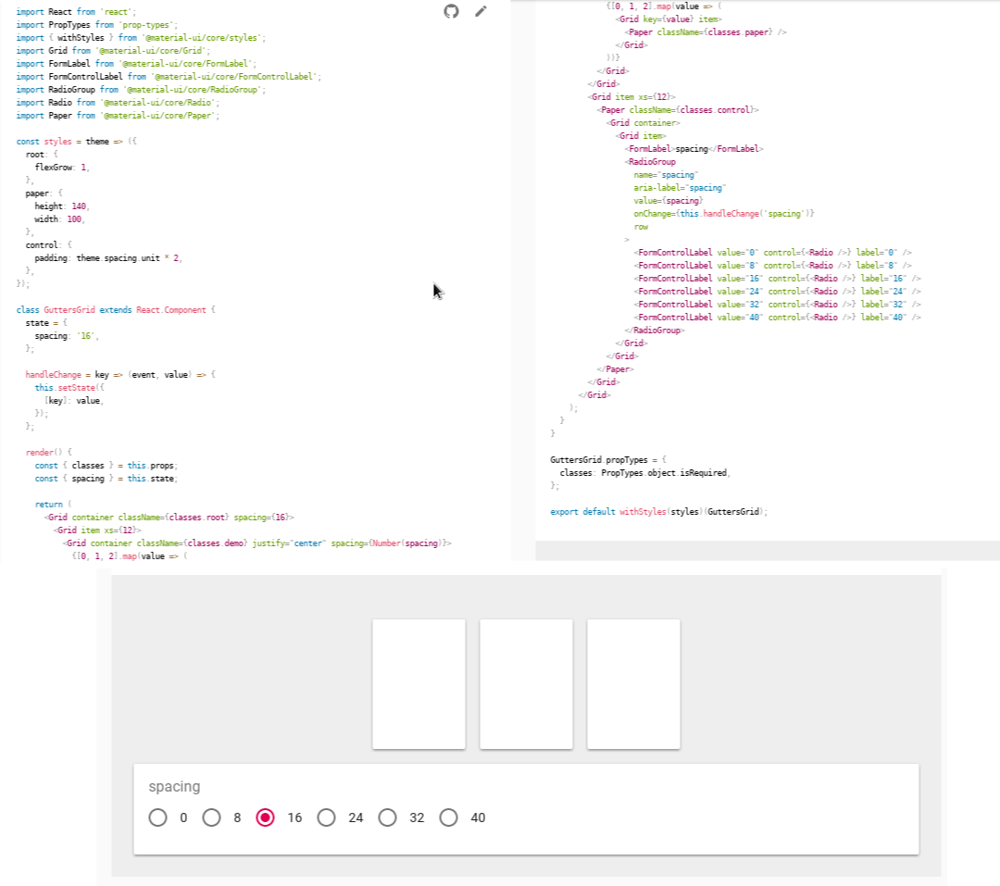

### Semantic UI

Es un framework de CSS diseñado para ser semánticamente limpio. Su integración con React facilita su uso, y la cantidad de código que utiliza, comparado con Material, es notoriamente menor.

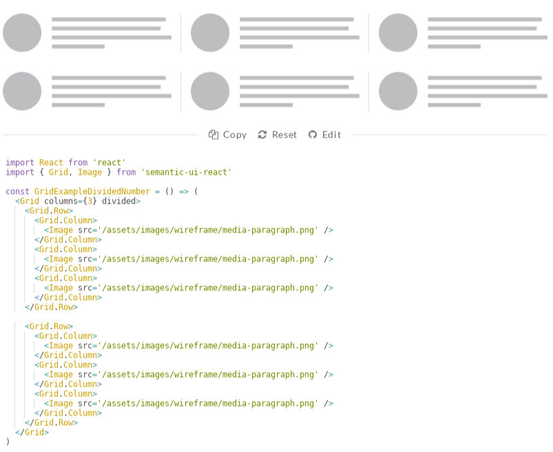

# Cuerpo de Solución

Para la creación de la solución se utilizó una adaptación de Scrum, esta adaptación se explica con mayor detalle en el Marco teórico.

Debido a que, como estudiantes, carecemos de un servidor para hacer pruebas y deployment, se utilizó Firebase, que provee una alternativa gratuita para la realización de backend sin la necesidad de la compra de un servidor. El motor de base de datos que usa firebase es NoSQL, ya que guarda los datos en JSONs, como consecuencia de esto, la estructura de la base de datos no está normalizada, o lo que es resulta más acertado: la estructura de datos está desnormalizada.

Se utilizó React en conjunto con Semantic-UI para la creación del frontend.

El sistema no está finalizado, se llegó hasta donde el tiempo lo permitió, no se contó con el suficiente tiempo para su realización debido a que tareas de otras asignaturas, (así como también de esta misma asignatura) acapararon gran parte del tiempo dedicado a la universidad, y el resto del tiempo fue dedicado a requerimientos del trabajo y necesidades fundamentales personales.

## Ingeniería de requerimientos

Se identificaron tres roles:

* **Estudiante** Persona que se inscribe a las materias y asiste a las clases
* **Docente** Persona que es contratada para impartir las materias, y las imparte durante la gestión académica
* **Administrador** Persona que mantiene al sistema actualizado con la realidad, en tanto no sea posible para docentes y estudiantes.

### Historias de usuario

**ADMINISTRADOR**

1. Como administrador quiero dar a los docentes contratados un periodo de tiempo para que actualicen la información que necesito antes del comienzo de la gestión académica.

2. Como administrador quiero poder actualizar la información faltante de los docentes en caso de que ellos no la actualicen en el tiempo estipulado.

3. Como administrador quiero poder administrar la disponibilidad de aulas para que esté actualizado en todo momento y pueda ser distribuido de una forma más responsable.

4. Como administrador quiero poder notificar a los estudiantes de sus fechas de inscripción e instruccciones pertinentes par minimizar las filas.

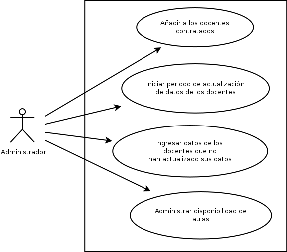

---

**ALUMNO**

5. Como alumno quiero poder ingresar a mi cuenta en el sistema de forma fácil y sin tener que recordar contraseñas.

6. Como alumno quiero ser notificado de las fechas de inscripción.

7. Como alumno quiero poder inscribirme fuera de la fecha de inscripción.

8. Como alumno quiero que mis méritos académicos me provean prioridad en las inscripciones para poder inscribirme con mis docentes preferidos.

9. Como alumno quiero conocer y ser notificado de las fechas de los exámenes para que la falta a uno de ellos no cause mi abandono.

10. Como alumno quiero conocer el plan de distribución de notas de cada una de las materias que voy a tomar para poder elegir al docente que más me conviene.

11. Como alumno no quiero verme atrapado durante el semestre con un docente con el que sé que voy a reprobar para evitar el abandono de la materia.

12. Como alumno quiero conocer mis notas de forma oportuna y constante para saber cuándo me está comenzando a ir mal, poder rectificarlo, y así evitar el abandono de la materia

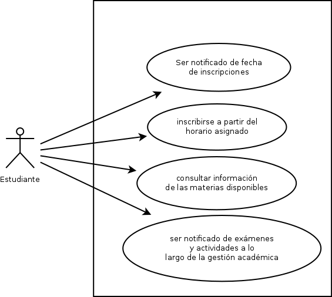

---

**DOCENTE**

13. Como docente quiero publicar el plan de la materia que voy a dictar antes de que comience la gestión académica para que mis alumnos sepan las reglas mediante las que trabajo.

14. Como docente quiero publicar las notas de las tareas de mis alumnos a lo largo del semestre mediante una hoja de cálculo para no depender de la aplicación web y poder trabajar en cualquier otro ambiente.

15. Como docente quiero poder notificar a mis alumnos de sucesos fortuitos para que estén al tanto de la materia.

16. Como docente quiero poder recibir dudas de mis alumnos, y ser notificado de ello, para poder resolverlas y elevar el nivel académico de mi materia

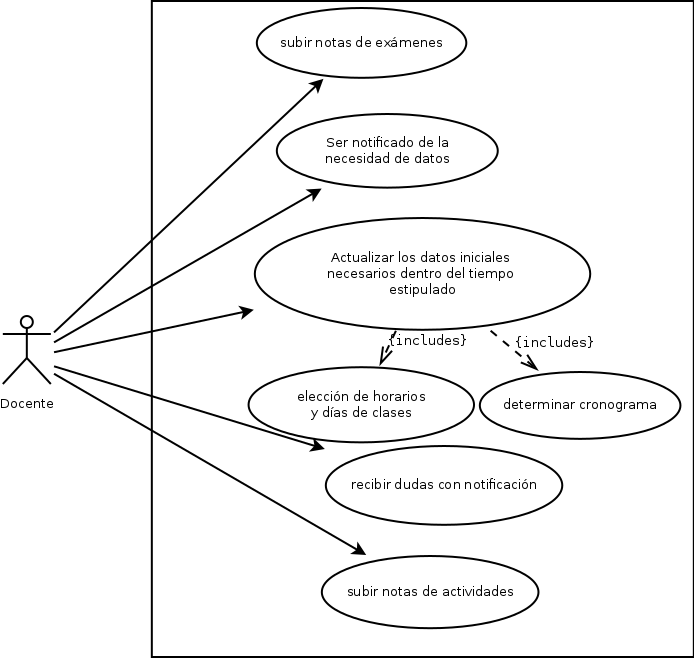

## Diagrama de datos

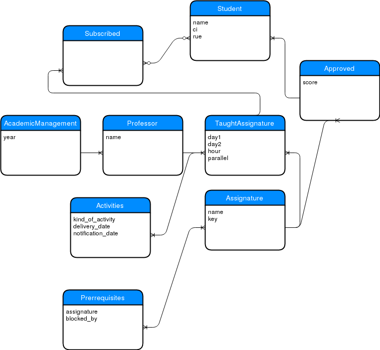

## Proceso de la gestión académica

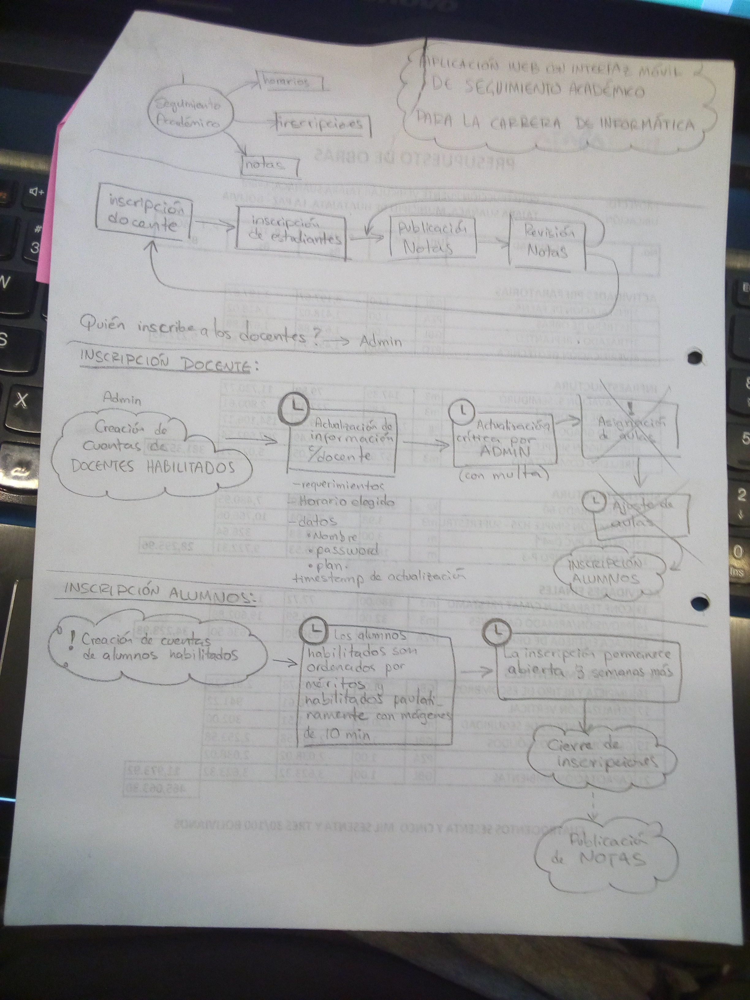

## Backlog

## Capturas de pantalla

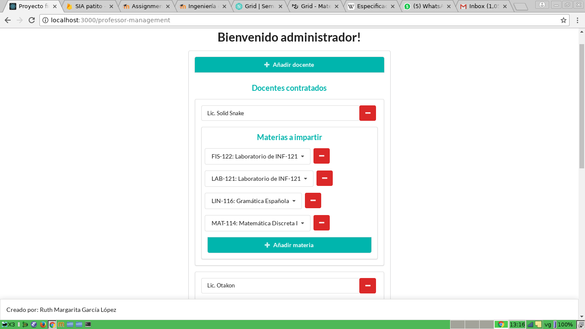
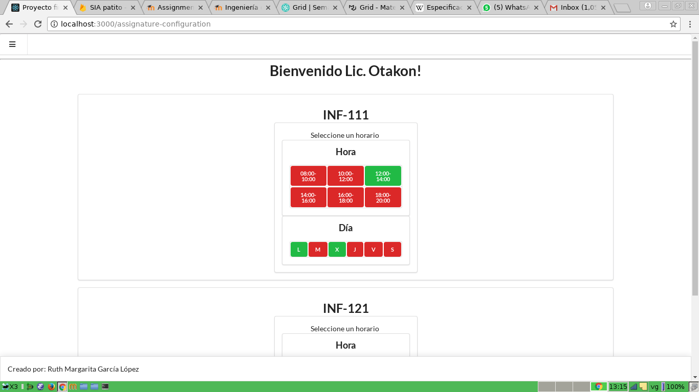
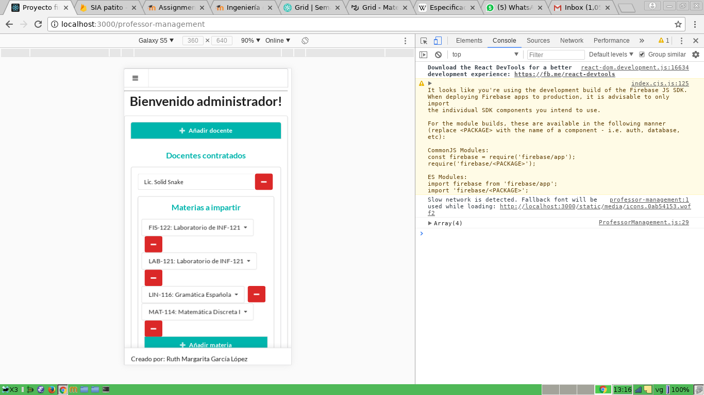
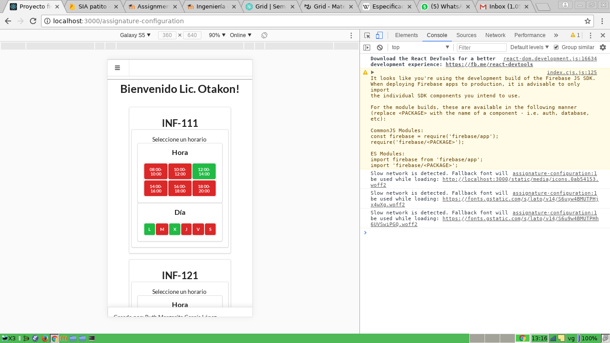
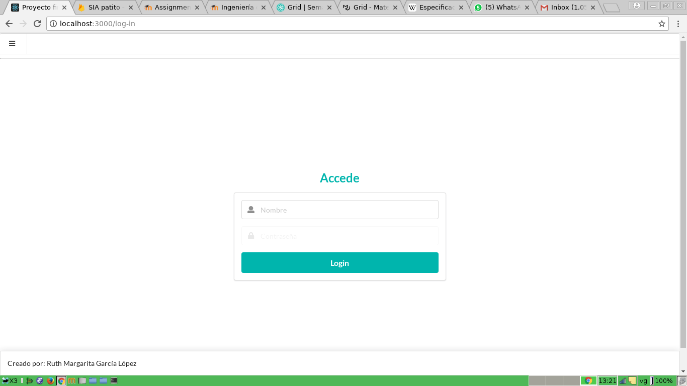
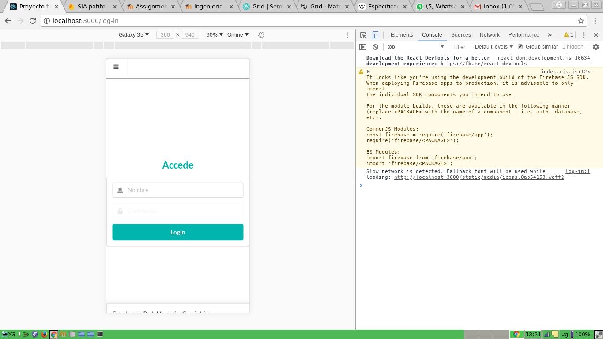

## Bitácora

* 17/04/2018: Estudio de otros sistemas de seguimiento académico
* 21/04/2018: Análisis de DNSIA
* 21/04/2018: Entrevista informal con estudiante de informática sobre DNSIA
* 21/04/2018: Revisión de comentarios en redes sociales sobre SIA y DNSIA
* 22/04/2018: Creación del backlog y diagramas
* 05/05/2018: Revisión de herramientas
* 06/05/2018: Decisión de herramientas a usar
* 12/05/2018: Estudio de React
* 13/05/2018: Aprendizaje de Material UI
* 16/05/2018: Decisión de migrar a Semantic UI
* 20/05/2018: Tutorial de React
* 23/05/2018: Creación de componente de materia configurable para docentes
* 26/05/2018: Creación de componente Professor para configuración por parte de docentes
* 27/05/2018: Integración con Firebase
* 27/05/2018: Creación de componente de profesor editable para configuracióin por parte del administrador
* 28/05/2018: Integración con Firebase
* 28/05/2018: Login temporal
* 29/05/2018: culminación de esta bitácora
* 29/05/2018: Integración de documentación y diagramas

# INSTALACIÓN

## Requisitos:
* npm versión 6.1.0 en adelante
* conexión a internet

## Instalación:
Si aún no ha adquirido el código fuente, clónelo con el siguiente comando:

$ git clone http://github.com/VengadoraVG/proyecto-final-163-I-2018

Luego, desde la carpeta raíz del código fuente (o desde la carpeta que contiene a este archivo, ejecute la siguiente línea de comando:

$ npm install
$ npm start

La aplicación será servida en algún puerto de localhost, por lo general, en http://localhost:3000

Es imperativo que la aplicación tenga acceso a internet debido a que se utilizan los servicios gratuitos de base de datos instantánea de firebase.

# Documentación

React se basa en componentes. Cada pantalla de la aplicación web está determinada por un componente de react. Estos componentes se encuentran en la carpeta `src/components/`

* App: el punto de entrada

* AssignatureConfiguration: Provee una interfaz para la configuración de horas y días para cada docente contratado.

* Assignature: Provee una interfaz para la configuración de una sola materia. Es usado por AssignatureConfiguration.

* AssignatureSelector: Provee una interfaz para la selección de una materia.

* DaySelector: Provee una interfaz con un grupo de botones que permite seleccionar dos días de la semana

* HourSelector: Provee una interfaz con un grupo de botones que permite la selección de una hora en intérvalos de dos.

* Login: Provee una interfaz momentánea para que los docentes accedan a su pantalla de configuración de materias.

* MultipleSelector: Provee una interfaz genérica mediante un grupo de botones que pueden ser seleccionados de forma múltiple.

* Navigation: Provee la interfaz de la barra de navegación superior.

* NewProfessor: Provee un popup `modal` que permite añadir un docente nuevo desde el pánel del administrador.

* ProfessorManagement: el pánel de configuración del administrador mediante el cuál puede contratar profesores y asignarles materias.

Para la documentación para CSS, por favor, referirse a http://react.semantic-ui.com debido a que ese fue el framework usado.fLyMd-mAkEr
